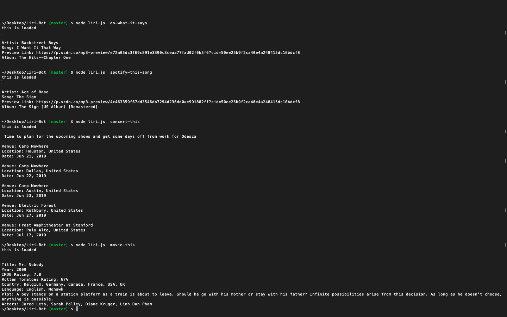

# Liri-Bot

LiriBot LIRI is a Language Interpretation and Recognition Interface. LIRI will be a command line node app that takes in parameters and gives you back data.

LIRI uses Spotify, OMDB, and Bands In Town API to give the consumer information about a song, a band, or a movie using the following commands. Also feel free to try our command using do-what-it-says and see your result.

spotify-this-song concert-this movie-this

The return data will be displayed within the command terminal where the commands were entered.

## Built with :

* [Node](https://www.w3schools.com/nodejs/nodejs_intro.asp) 

* [Javascript](https://www.w3schools.com/js/js_intro.asp)

## Authors

* [Raghav Shiv](https://github.com/rshiv7)